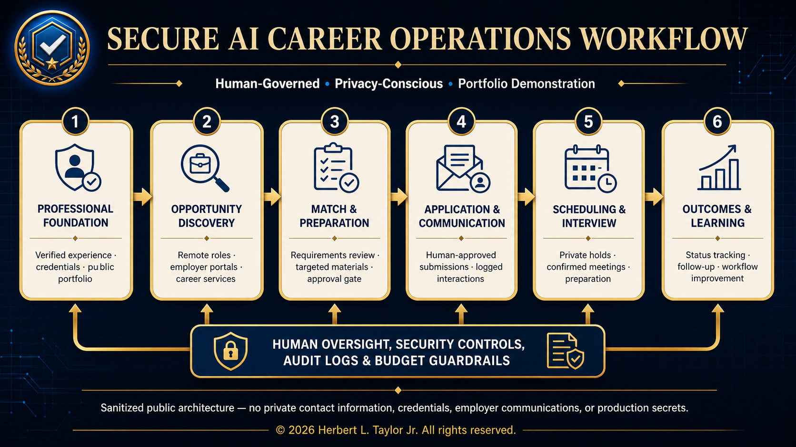
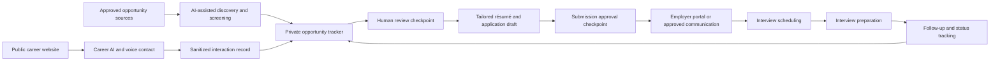

# Secure AI Career Operations Workflow

A privacy-conscious, human-governed career operations system designed to coordinate professional presentation, opportunity discovery, application preparation, employer communications, scheduling, interview preparation, and career-assistant experiences.

This repository is a **sanitized portfolio demonstration**. It contains no production credentials, private career records, employer communications, caller information, application data, or personal contact information.

*Sanitized public architecture showing the six-stage workflow and the human oversight, security, audit, and budget controls applied across it.*

## Project leadership

**Role:** Product Owner, Workflow Architect, and AI-Assisted Implementation Lead

The project demonstrates requirements management, systems thinking, privacy-by-design decisions, security controls, integration planning, testing, documentation, and human oversight of AI-assisted work.

## Portfolio capabilities

- Public professional dashboard and privacy-sanitized résumé presentation
- Career-focused AI question-and-answer experience
- AI voice contact workflow with disclosure and consent boundaries
- Opportunity discovery across approved career sources
- Human-reviewed résumé tailoring and application preparation
- Approval-gated employer communication and application submission
- Private scheduling and interview preparation
- Activity tracking, analytics, reminders, and audit records
- Security, fraud-resilience, retention, and cost-control checks

## High-level workflow

## Human approval boundaries

The system may autonomously organize public information, identify opportunities, generate drafts, prepare reminders, and summarize approved records. It must not independently:

- Submit job applications
- Send employer messages or make commitments
- Schedule external meetings without approval
- Upload private documents to third parties
- Disclose medical, legal, disability, financial, or account information
- Change production permissions, billing, or retention settings
- Treat network-presented caller identification as verified identity

## Security model

- Secrets remain server-side and outside source control
- Least-privilege connectors and scoped calendars
- Signed webhook verification, replay protection, and deduplication
- Untrusted-content and prompt-injection handling
- Data minimization and sanitized logging
- Explicit AI disclosure and consent handling
- No public production dashboards, private analytics, or operational records
- Human approval before consequential external actions

See [Security](SECURITY.md), [Privacy boundaries](docs/privacy-boundaries.md), and [Testing](docs/testing.md).

## Repository map

| Path | Purpose |
|---|---|
| `docs/architecture.md` | System components and data-flow boundaries |
| `docs/privacy-boundaries.md` | Public, private, restricted, and prohibited data rules |
| `docs/testing.md` | Security, privacy, accessibility, and workflow test plan |
| `sample-data/fictional-opportunity-tracker.csv` | Fictional example records only |
| `COPYRIGHT.md` | Rights notice for original portfolio material |
| `THIRD_PARTY_NOTICES.md` | Platform and trademark acknowledgments |
| `SECURITY.md` | Vulnerability-reporting and secret-handling policy |

## Important limitations

This portfolio describes architecture and controls, not a claim that every component is fully autonomous or immune to error. AI output requires verification. External content is treated as untrusted. Production system details, credentials, and private records are intentionally excluded.

## Rights

No open-source license is granted at this stage. See [COPYRIGHT.md](COPYRIGHT.md).

