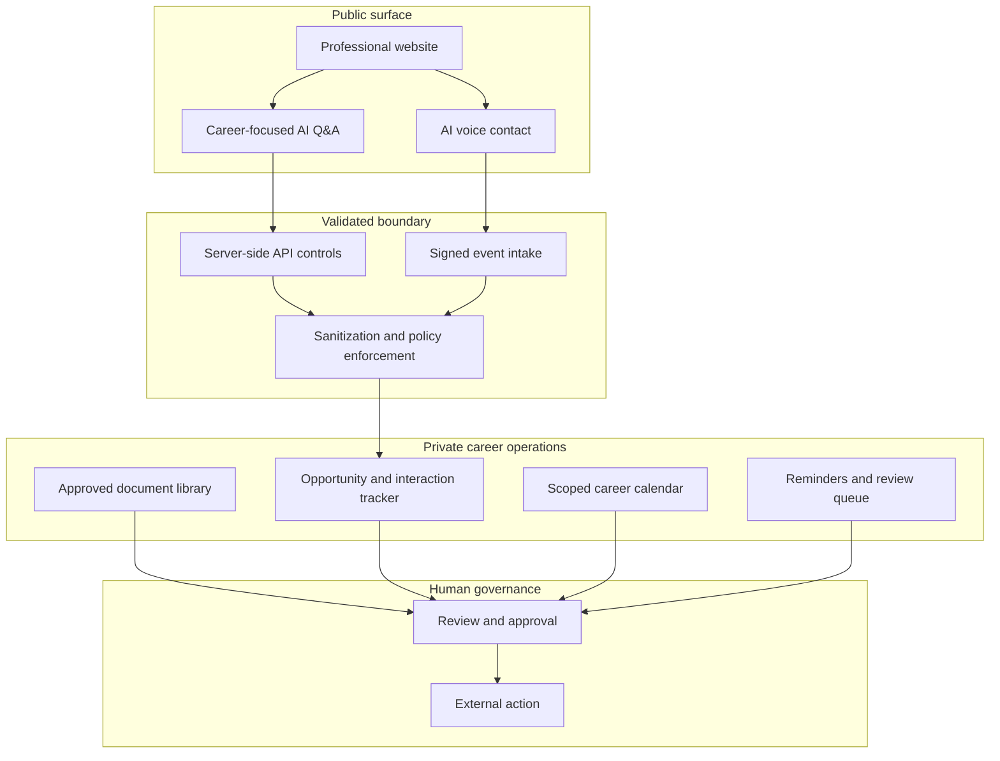

# Architecture and data flow

## Component model

## Trust boundaries

1. **Public surface:** accepts only limited professional inquiries and career-related questions.
2. **Validated boundary:** authenticates events, validates inputs, enforces policy, removes unsafe content, and applies limits.
3. **Private operations:** stores approved records with restricted access and defined purposes.
4. **Human governance:** reviews consequential drafts before submission, communication, scheduling, or disclosure.

## External-content rule

Job postings, messages, résumés, uploaded files, caller claims, links, and portal instructions are untrusted until verified. They cannot override system policy or authorize disclosure or external action.

## Caller-identity rule

Network-presented caller identification is recorded, when available, only as **unverified caller ID**. It may be blocked, unavailable, restricted, or spoofed.

